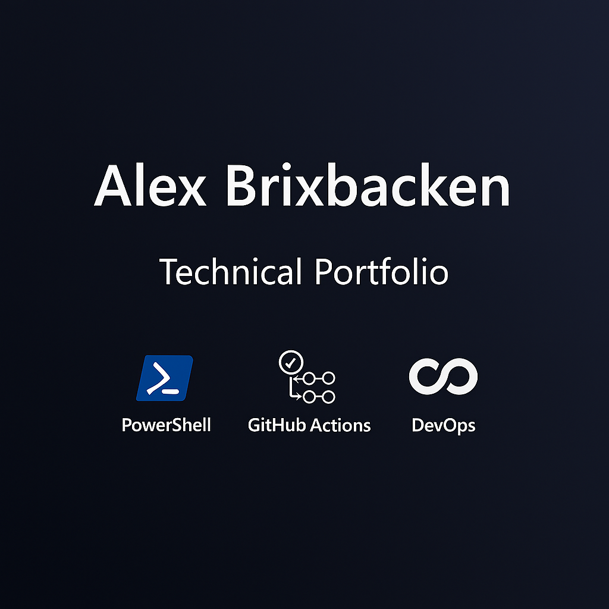

<<<<<<< HEAD
# 👨‍💻 Alex Brixbacken — Technical Portfolio

## 📘 About Me
I'm a multilingual IT infrastructure and automation student based in Sweden, currently studying at JENSEN Yrkeshögskola. I specialize in PowerShell scripting, GitHub workflows, and cloud DevOps pipelines.

## 🧰 Skills
=======
# alexB
Desarrollador web.
#  Alex Brixbacken — Technical Portfolio

##  About Me
I'm a multilingual IT infrastructure and automation student based in Sweden, currently studying at JENSEN Yrkeshögskola. I specialize in PowerShell scripting, GitHub workflows, and cloud DevOps pipelines.

##  Skills
>>>>>>> fde96a8d4a388d0bec74f920be97c0ec9eaa02de
- PowerShell automation for repo cleanup and documentation
- GitHub Actions for CI/CD and Azure deployment
- AWS CodePipeline and CodeBuild troubleshooting
- Multilingual technical communication (Swedish, Spanish, English)

<<<<<<< HEAD
## 📦 Featured Projects
=======
##  Featured Projects
>>>>>>> fde96a8d4a388d0bec74f920be97c0ec9eaa02de
- [text-mi-analyzer](https://github.com/AlexB1974/text-mi-analyzer): Mutual Information calculator for text classification
- [ubuntu-school](https://github.com/AlexB1974/ubuntu-school): Linux-based school automation scripts
- [skills-deploy-to-azure](https://github.com/AlexB1974/skills-deploy-to-azure): Node.js deployment workflow to Azure Web App

<<<<<<< HEAD
## 🎯 Goals
=======
##  Goals
>>>>>>> fde96a8d4a388d0bec74f920be97c0ec9eaa02de
- Master Swedish for full integration and career advancement
- Automate technical and academic workflows for clarity and efficiency
- Build a professional identity through reproducible, documented solutions

<<<<<<< HEAD
## 📫 Contact
Email: alexbrixbacken@gmail.com  
Location: Stockholm, Sweden
---

## 📊 Repo Stats

=======
##  Contact
Email: alexbrixbacken@gmail.com  
Location: Stockholm, Sweden
>>>>>>> fde96a8d4a388d0bec74f920be97c0ec9eaa02de
